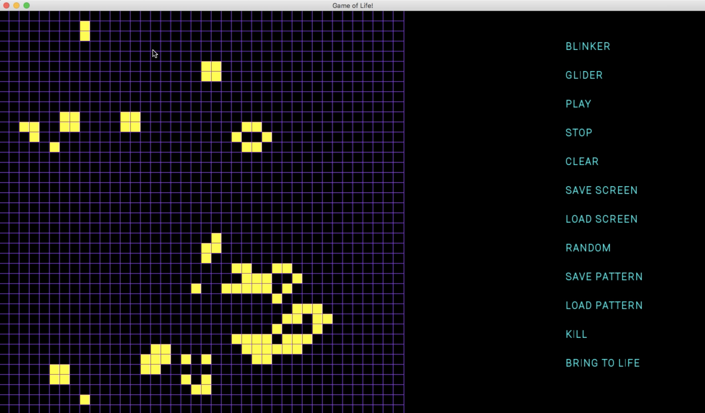
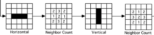
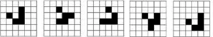

<h1 align="center">Game of Life</h1>

  

   <a href="https://www.youtube.com">View Demo</a>
  

<!-- TABLE OF CONTENTS -->

  
Table of Contents

  <ol>
    <li><a href="#project-description">Project Description</a></li>
    <li><a href="#contribution">Contribution</a></li>
    <li><a href="#contact">Contact</a></li>
  </ol>

  
  
  
<h2 align="center">Project Description</h2>

The goal of this project is to create a simulation of John Conway's Game of Life using two-dimensional arrays. Each element of the array represents a cell that is either alive or dead. Once an initial state is set up, the program will generate new generations based on the following *Rules of the Game*:

- A live cell with two or three live neighbors will remain alive.
- A live cell with fewer than two live neighbors will die.
- A live cell with more than three live neighbors will die. 
- A dead cell with exactly three live neighbors will become a live cell. 

The "neighbors" of a cell are the adjacent and diagonal cells. 

### Purpose
- Design: Building  a  function  hierarchy  that  will make  managing  this  process  easier.  Low-­level functions that will act as tools on top of which higher level functions will be build upon. This is the most important part of this project as we spent a great deal of time talking about this issue not to mention all the projects we built with these ideas in  mind.

- Functions: There will be many functions used to break down the project into specific tasks that must  be performed each time a new generation is  generated.

- Input/Output  streams: Files  will  be  used  to  import  and  export  a  pattern  or  generation’s  current  state.

- Arrays: This  is  the  heart  of  the  project;  a  two-dimensional  array  is  used  to  represent  a  generation  of  cells,  with  each  element  of  the  array  representing  an  individual  cell.

### Circular
The board is virtually connected by the edges and the corners:
*The first row and the last row are neighbors (adjacent) and the first column and the last column are neighbors (adjacent) so, a cell on the first row will have neighbors on the last row.*

Consider  the  example  of  the  top-­‐left  corner  cell:
*This cell must be able to use the last 2 cells on the bottom, the last 2 cells on the right, and the lower-­‐right corner cell as its neighbors. By using the border to reflect those cells, the task of checking the neighbors of the
corner cell is greatly simplified.*

### Save/Load
Patterns can be exported and imported to and from text files.
The text files will simply be characters used to represent consecutive cells as either alive or dead, separated by line breaks to differentiate between rows.

### Common Patterns:
**Blinker**

**Glider**

<h2 align="center">Links</h2>

Rules explanation on Youtube : [here](https://www.youtube.com/watch?v=ouipbDkwHWA&ab_channel=EricSteinhart)

<h2 align="center">Contribution</h2>

Contributions are what make the open source community such an amazing place to learn, inspire, and create. Any contributions you make are **greatly appreciated**.

1. Fork the Project
2. Create your Feature Branch (`git checkout -b feature/AmazingFeature`)
3. Commit your Changes (`git commit -m 'Add some AmazingFeature'`)
4. Push to the Branch (`git push origin feature/AmazingFeature`)
5. Open a Pull Request

<h2 align="center">Contact</h2>

Jieun Lee 
 

Project Link: [https://github.com/JinnnyWinnny/Projects](https://github.com/JinnnyWinnny/Projects)

